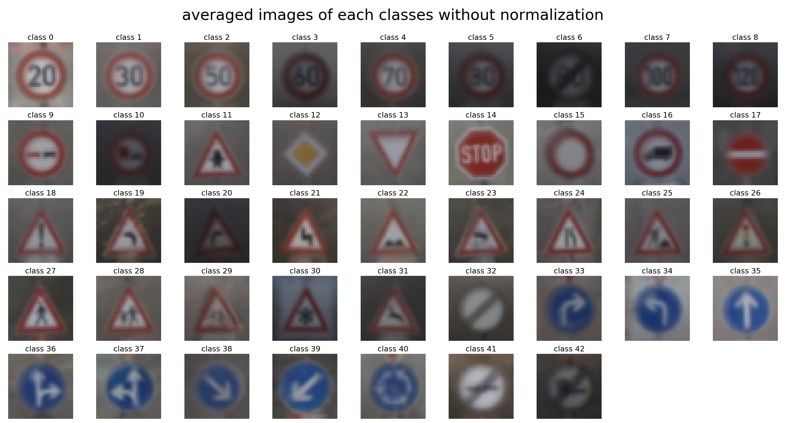
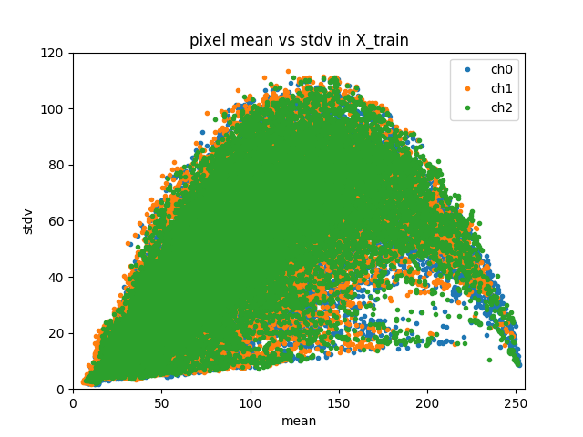
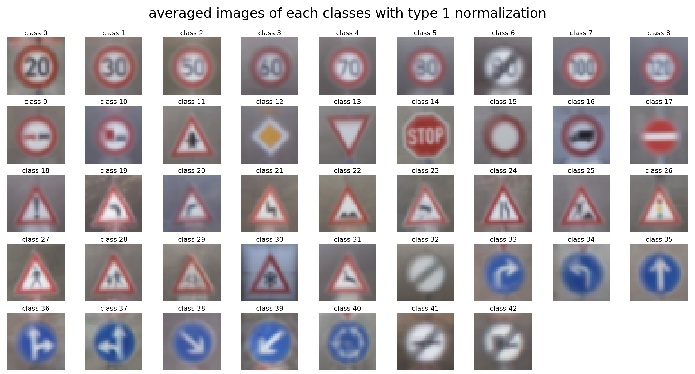
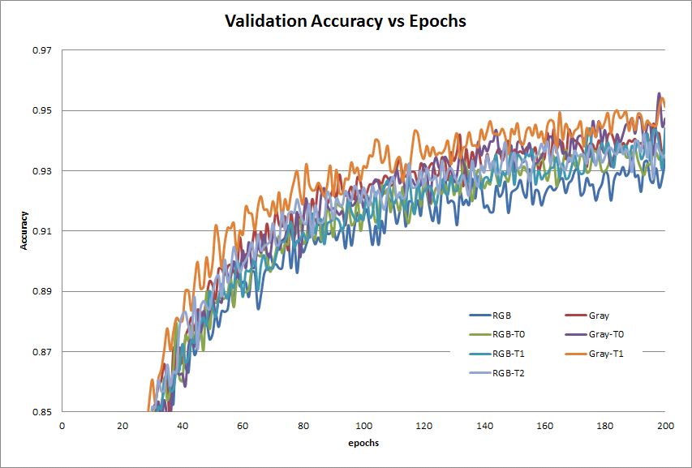
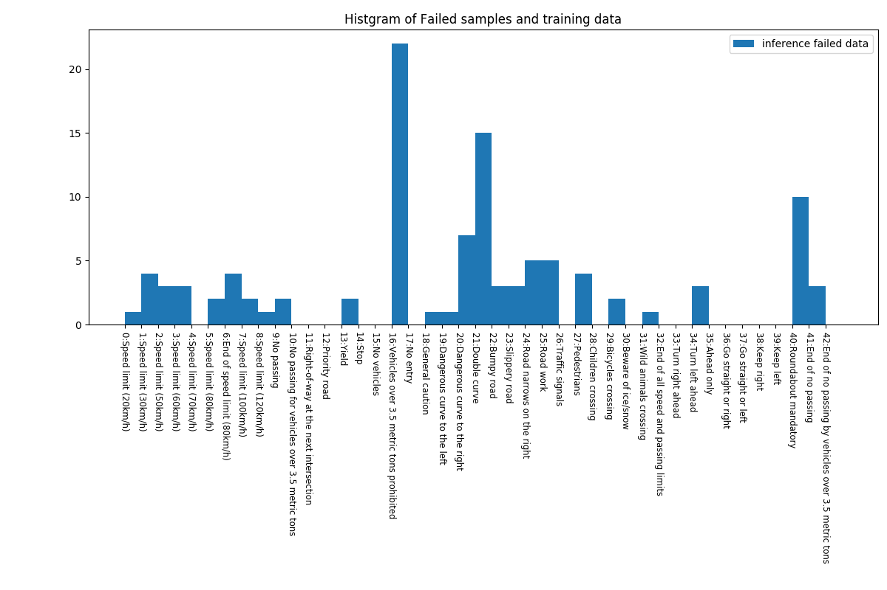
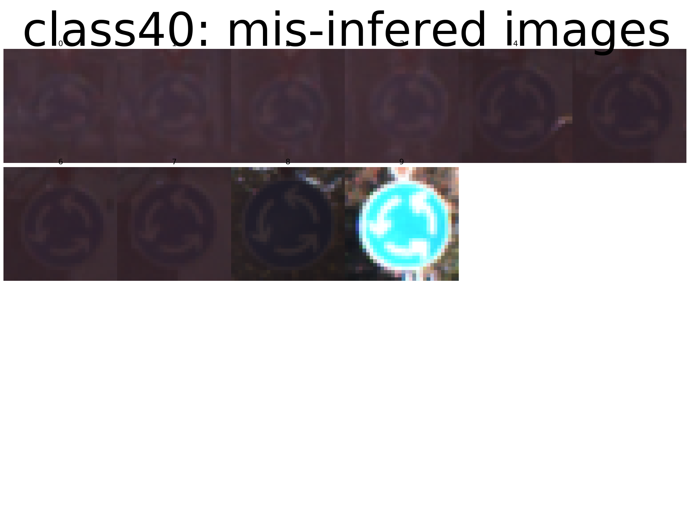
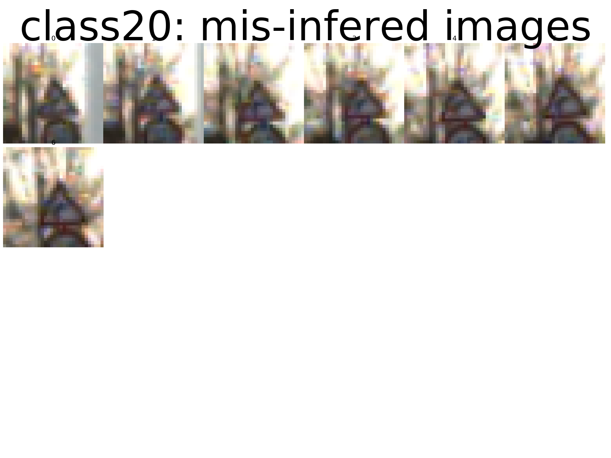
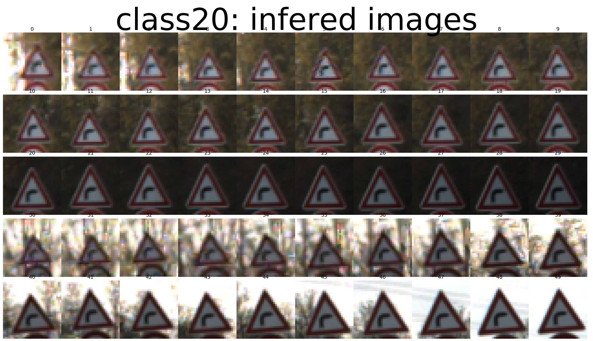
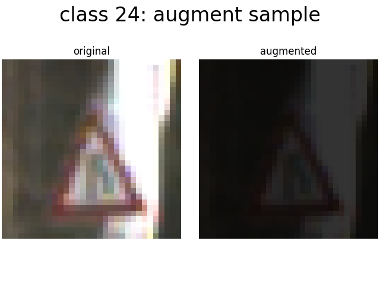
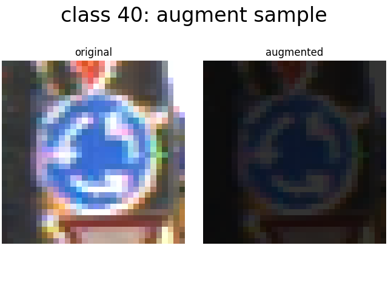

#**Traffic Sign Recognition** 

---

**Build a Traffic Sign Recognition Project**

#1. Submissions

---

- [Code](https://github.com/somof/CarND-Traffic-Sign-Classifier-Project-work/blob/master/Traffic_Sign_Classifier.ipynb)
- [Writeup](https://github.com/somof/CarND-Traffic-Sign-Classifier-Project-work/blob/master/writeup.md)

[//]: # (Image References)

<!-- [image1]: ./examples/visualization.jpg "Visualization" -->

[image2]: ./examples/grayscale.jpg "Grayscaling"
[image3]: ./examples/random_noise.jpg "Random Noise"
[image4]: ./examples/placeholder.png "Traffic Sign 1"
[image5]: ./examples/placeholder.png "Traffic Sign 2"
[image6]: ./examples/placeholder.png "Traffic Sign 3"
[image7]: ./examples/placeholder.png "Traffic Sign 4"
[image8]: ./examples/placeholder.png "Traffic Sign 5"

---

#2. Data Set Summary & Exploration

##2.1. a basic summary of the data set.

Here are summary statistics of the traffic signs data sets:

* The size of training set is 34799
* The size of the validation set is 4410
* The size of test set is 12630
* The shape of a traffic sign image is (32, 32, 3)
* The number of unique classes/labels in the data set is 43

  

Each datasets have the different frequency distribution of the traffic signs as follows.  
In the training dataset, some classes have only two hundreds images, and may cause a shortage to adequately train.  
And there is near ten times difference among 43 classes that is possible to unfair train and to infer at low qualities.  

The following shows each class's mean value of its image's pixel mean values.  
Some classes, like 6, 20, 10 and 8, have very dark images that may mean low contrast dataset.

The following is each class's standard deviation(stdev) of its images's pixel mean value.   
Some classs, like 6, 21, 27, 21 and others, have very low deviation compared to other classes that also can cause unfair training.

As explained above, the training dataset may have some issue to train like:  
 1. sample number shortage in some lables  
 2. low contrast(dark) images  
 3. low variance in some classess  

##2.2. an exploratory visualization of the dataset.

Here is a quick look that shows images sampled from the training dataset.  
The dataset has a lot of similar images that seem to be augmented via image processing techniques like changing brightness, contrast, chroma and cropping position.

##2.3. averaged class images of the dataset.

Here are the typical class images(the first image of the class in the training dataset)  and class averaged images.

All class averaged images still keep their own characteristic enough to recognize as traffic signs.  
But some classes seem to have troubles as follow.

 1. low chroma at class 6, 32, 41, 42
 2. un-necessary background texture at class 16, 19, 20, 24, 30
 3. dark brightness at class 3, 5, 6, 7, 10, 20

<!--  -->

#3. Feasibility Study

As described above, the training dataset potentially has trouble factors.  
So I had a feasibility study before selecting methods for pre-processing, CNN design and augmenting image data in order to reduce the training data risk.

For the feasibility study, I made a reasonable scale model.  
This model is bigger than the LeNet-5(lesson 8) and would be smaller than the final model, so I named it "middle model".

###3.1 design of "middle model" and training hyperparameters

Here is the specification of "middle model" and training parameters.

| Layer         		|     Description	        					| 
|:----------------------|:----------------------------------------------| 
| Input         		| 32x32x3 RGB/Gray image   						| 
| Convolution 5x5     	| 1x1 stride, VALID padding, outputs 28x28x16 	|
| Batch Normalization	|												|
| RELU					|												|
| Max pooling	      	| 2x2 stride, VALID padding, outputs 14x14x16	|
| Convolution 5x5     	| 1x1 stride, VALID padding, outputs 10x10x48 	|
| RELU					|												|
| Max pooling	      	| 2x2 stride, VALID padding, outputs 5x5x48		|
| flatten				| 5x5x48 => 1200 								|
| Fully connected		| outputs 100  									|
| RELU					|												|
| Dropout				| keep prob. 0.5								|
| Fully connected		| outputs 100  									|
| RELU					|												|
| Dropout				| keep prob. 0.5								|
| Softmax				| outputs 43 (class number)						|

| Title         		|     Description	        					| 
|:----------------------|:----------------------------------------------| 
| Optimizer				| Adam
| learning_rate			| 0.0002
| batch size			| 100
| EPOCH Number			| 200

###3.2 normalization methods for pre-processing

Following figure is a pixel mean and stdev distribution for each images in the training dataset.  
It shows the dataset is not normalized yet.

To make training work better, following normalization types are possible at first.

 - Type0: normalize for all images in the training data
 - Type1: normalize for each images
 - Type2: normalize for each image planes (like RGB each normalization)

Following figures are the distributions of the each normalization types.  
The normalization types can control the distribution spread as below.

Following images are averaged class images of each normalization type.  
The average images express a part of the effect of the normalization.
Relatively to the average images without normalization, the dark brightness issue is declined by type 1 and 2 normalization method.
But the low chroma and background texture issues still remain in the normlaized images.

###3.3 potential of "middle model" for the normalization type and color information use

To check the potential of the middle mode, I examined 7 types of input data as follows.

| No | Title      | image type | Normalization type									| 
|:---|:-----------|:-----------|:---------------------------------------------------| 
| 0  | RGB        | RGB-3ch    | Not normalized										|
| 1  | RGB-Type0  | RGB-3ch    | normalized for all pixels in the training data		|
| 2  | RGB-Type1  | RGB-3ch    | normalized for each images pixels					|
| 3  | RGB-Type2  | RGB-3ch    | normalized for RGB each image plane pixels			|
| 4  | Gray       | Gray       | Not normalized										|
| 5  | Gray-Type0 | Gray       | normalized for all pixels in the training data		|
| 6  | Gray-Type1 | Gray       | normalized for each images pixels					|

Normalization is executed by a follwing equation.

    normalized_image = (org_image - mean) / (2.0 * stdev)

Following figures are accuracy curves and the last accuracies for the 3 dataset.  
After 200 epochs, every types obtained 93% accuracy of the validation dataset and seem to have possibility to get more accuracy as below .  
Gray-scale inputs got more validation accuracy, but less test data accuracy than RGB input.

###3.4 selection of pre-processing method for the input data format

I take **take RGB-type1** as the input format to study hereafter, though the feasibility study shows that **gray scale gets better validation accuracy than RGB input**.

All the 7 input format types, include RGB format, will satisfy the 93% accuracy goal of the project.  
So I decided to challenge something like that can solove the low-chroma and the background texture issues above.

The RGB input may be useful to make sure what modification affects to the training issues.

###3.5 a result of "middle model" with RGB-type1 input

Using "middle model" with RGB input image after the type1-normalization, I got the frequency of the failure of it as below.  
This means there may be new trouble other than dataset issue described above.

<!-- (array([ 1,  4,  3,  3,  0,  2,  4,  2,  1,  2, -->
<!-- 	      0,  0,  0,  2,  0,  0, 22,  0,  1,  1, -->
<!-- 		  7, 15,  3,  3,  5,  5,  0,  4,  0,  2, -->
<!-- 		  0,  1,  0,  0,  3,  0,  0,  0,  0,  0, -->
<!-- 		 10,  3,  0]),  -->

Compare to the numbers of the training data, classes that have many failure don't seem to have enough training data as below.

###3.6 quick looks of failed images at "middle model" with RGB-type1 input

####3.6.1 class 16

All of the failure images have very low-chroma images, and the training dataset for the class dosesn't have such images.

 

####3.6.2 class 21

About half of the failure images have very low resolution like that mostly human also may mis-understand.  
But the rest of the failure, I can not specify its factor to cause the mis-inferences.

 

####3.6.3 class 40

Almost of all the failure images have very dark brightness like that I can not recognaize without something like image enhancements.  

 

####3.6.4 class 20

All of the failure images have small traffic sign in its scope.

 

####3.6.5 class 24

All of the failure images have very dark and low-contrast.
But I can not specify the difference to the images successful infered.

 

####3.6.6 class 27

All of the failure images have high contrast background.
The normalization method may not work well on such images.

 

###3.7 7x7 CNN trial

I tried to enlargep the filter tap size of the first convolutional networks, because the quick looks above showed that "middle model" may not be enough to express the charactoristics of the each classes.

Following figure shows 4 model architecture's accuracy curve for each epoch.  
"5x5" or "7x7" means CNN's tap size, and "0bn" or "1bn" means usage of batch normalization. ("0bn" is No batch normalization model)

No-batch-normalization models reached near their peak accuracy about at epoch 500.  
Batch-normalization models had a low accuracy level, at least, before epoch 1000, though they have possibility of more high accuracy at over 1000 epochs.

It might be better for batch normalization models to take more high training-rate than no-batch-normalization models.  
Here, to compare under eauql conditions, all the 4 models use 0.0002 as the training-rate.

#4. Design and Test a Model Architecture

##4.1 "large model" architecture

As the feasibility study, I chose the final model as below.
I call the final model architecture "large model".

The unit numbers were set adequate value, watching varying histgram on the Tensorboard. (It's a fantastic tool!)  
CNN's filter size 64 / 84 and FC's unit size 240 are moderate values that can get smooth histgrams of their weights.

The final model has two dropout to prevent overfitting.

| Layer         		|     Description	        					| 
|:----------------------|:----------------------------------------------| 
| Input         		| 32x32x3 RGB image								| 
| Convolution 5x5     	| 1x1 stride, VALID padding, outputs 28x28x64	|
| RELU					|												|
| Max pooling	      	| 2x2 stride, VALID padding, outputs 14x14x64	|
| Convolution 5x5     	| 1x1 stride, VALID padding, outputs 10x10x84 	|
| RELU					|												|
| Max pooling	      	| 2x2 stride, VALID padding, outputs 5x5x84		|
| flatten				| 5x5x48 => 2100 								|
| Fully connected		| outputs 240  									|
| RELU					|												|
| Dropout				| keep prob. 0.5								|
| Fully connected		| outputs 240  									|
| RELU					|												|
| Dropout				| keep prob. 0.5								|
| Softmax				| outputs 43 (class number)						|

##4.2 training hyperparameters

The training Hyperparameters are same to "middle model".  
They are also defined for slow training to prevent overfitting.

| Title         		|     Description	        					| 
|:----------------------|:----------------------------------------------| 
| Optimizer				| Adam
| learning_rate			| 0.0002
| batch size			| 100
| EPOCH Number			| 1000

##4.3 pre-processing via RGB-type1

Input images were kept color planes and pre-processed via type 1 normalization described above.  
This method is not the best way to get the highest accuracy, but valuable to study enforcing the model architecture.

##4.4 training result

After training on the jupyter notebook, I got the result after 307 epochs as below,
though "large model" can get over 0.98 validation accuracy with more epochs.

  - training set accuracy of 0.99966
  - validation set accuracy of 0.97528
  - test set accuracy of 0.96207

Following is the accuracy curves for the datasets.

#5. Test a Model on New Images

I newly got 5 traffic sign images from the web, and made some analysis for the inferences via "large model".

#5.1 5 new images

At first, I got 12 new images searched by "german traffic sign" keywords with licence free opton,  
then selected 5 images in the point of view as follows.

|No |input image                                              | image size       | view point                                |
|:-:|:-------------------------------------------------------:|:-----------------|:------------------------------------------|
| 0 |  | 105 x 106, 96dpi | newly background textures 
| 1 |       | 299 x 168, 72dpi | a slant sign board
| 2 |    | 188 x 141, 72dpi | extra texures on the sign board
| 3 |    | 369 x 349, 96dpi | no background texture, but uniformly blue
| 4 |    | 259 x 194, 72dpi | extra texures on the sign board

#5.2 a summary of the inference to new images

Following table is the inference result for the 5 images via "large model".  
In spite of unkindness in the images, 4 images were correctly infered and the second probability level were very low.  
No.2 image, having a scissors illustration, became error.

No.5 is an example image that is correctly infered as class "17: No entry" for comparison to No.2 image.

|No | score |input image                                              | answer | inference                 |
|:-:|:-----:|:-------------------------------------------------------:|:------:|:--------------------------|
| 0 | O     |   | 4      | 4 : Speed limit (70km/h)
| 1 | O     |        | 13     | 13 : Yield
| 2 | X     |     | 17     | 3 : Speed limit (60km/h)
| 3 | O     |     | 33     | 33 : Turn right ahead
| 4 | O     |     | 40     | 40 : Roundabout mandatory
| 5 | O     |       | 17     | 17 : No entry

#5.3 the probability of the softmax

Following text shows the probabilities of the softmax value for each input images.  
Other than No.2 image, "large model" exactly infered its answer.

No.2 image was completely confused with class 3 "Speed limit (60km/h)" and the second probability was only 0.01% though the second inference correctly showed class 17.  

No.5 image was rightly infered but all the second to fourth probability showed Speed Limit sign board.  
It means the class 17 potentially has charactoristics similar to Speed Limit signs.

    No.0:
    answer:               4: Speed limit (70km/h)
      Top1:100.00% class  4: Speed limit (70km/h)
      Top2:  0.00% class  0: Speed limit (20km/h)
      Top3:  0.00% class  1: Speed limit (30km/h)
      Top4:  0.00% class  2: Speed limit (50km/h)
      Top5:  0.00% class  3: Speed limit (60km/h)
    
    No.1:
    answer:              13: Yield
      Top1:100.00% class 13: Yield
      Top2:  0.00% class 38: Keep right
      Top3:  0.00% class  0: Speed limit (20km/h)
      Top4:  0.00% class  1: Speed limit (30km/h)
      Top5:  0.00% class  2: Speed limit (50km/h)
    
    No.2:
    answer:              17: No entry
      Top1: 99.99% class  3: Speed limit (60km/h)
      Top2:  0.01% class 17: No entry
      Top3:  0.00% class  9: No passing
      Top4:  0.00% class 14: Stop
      Top5:  0.00% class 32: End of all speed and passing limits
    
    No.3:
    answer:              33: Turn right ahead
      Top1:100.00% class 33: Turn right ahead
      Top2:  0.00% class 25: Road work
      Top3:  0.00% class  0: Speed limit (20km/h)
      Top4:  0.00% class  1: Speed limit (30km/h)
      Top5:  0.00% class  2: Speed limit (50km/h)
    
    No.4:
    answer:              40: Roundabout mandatory
      Top1: 99.97% class 40: Roundabout mandatory
      Top2:  0.02% class 11: Right-of-way at the next intersection
      Top3:  0.00% class 18: General caution
      Top4:  0.00% class 16: Vehicles over 3.5 metric tons prohibited
      Top5:  0.00% class 37: Go straight or left
    
    No.5:
    answer:              17: No entry
      Top1:100.00% class 17: No entry
      Top2:  0.00% class  0: Speed limit (20km/h)
      Top3:  0.00% class  1: Speed limit (30km/h)
      Top4:  0.00% class  2: Speed limit (50km/h)
      Top5:  0.00% class  3: Speed limit (60km/h)

#5. Augmenting trainig images.

##5.1 plans to augment the training data

As described above, the original training dataset has shortages in the view points of quality and quantity for some classes.

Here is a summary of subjective issues on the training dataset.

 1. low chroma at class 6, 32, 41, 42
 2. un-necessary background texture at class 16, 19, 20, 24, 30
 3. dark brightness at class 3, 5, 6, 7, 10, 20 (Normalization may solve it)
 4. trainig data shortage at class 20, 21, 40 ...

Here is a summary of factors on mis-infered validation dataset.

 1. class 16 has a lot of failures particularly on low chroma images.
 2. class 21 has failures on low resolution images
 3. class 40 has failures on low brightness images
 4. class 20 has failures on small sign board images
 5. class 24 has failures on dark and low-contrast images
 6. class 27 has failures on high contrast background images

And I can take augmenting plans to resolve them as below.

 1. add low chroma images into class 16 training data
 2. add noisy image into class 21 training data
 3. add dark images into class 40 and 24 training data
 4. add shrink images into class 20 training data

<!--
| method                 | porpose                           | target class         |
|:-----------------------|:----------------------------------|:---------------------|
| enhance color			 | low-chroma expansion				 | 6, 32, 41, 42		|
| add vivid images		 | low-chroma expansion				 | 6, 32, 41, 42		|
| random value charge	 | back ground texture elimination	 | 16, 19, 20, 24, 30	|
| random position shift	 | back ground texture elimination	 | 16, 19, 20, 24, 30	|
| enhance brightness	 | dark brightness					 | 3, 5, 6, 7, 10, 20	|
| add bright images		 | dark brightness					 | 3, 5, 6, 7, 10, 20	|
| add various images	 | trainig data shortage			 | 20, 21, 40 ...		|
| ノイズを加える
-->

#5.2 Augmenting for class 16

At first, I tried augmenting to class 16 that has the most serious trouble in its dataset.  

About Class 16, the most of the mis-inference were occured on low-chroma images, and the training data didn't have such images.  
Therefore augmenting low chroma images would be effective to improve the accuracy of the class.

Following code is a specific method to augment the dataset.  
The code first duplicates a correspond image and make its chroma(saturation) low by a multiplication with 0.4.
It also modifies hue and brightness(intensity) to imitate the mis-infered images.

    for ans, org in zip(y_train, X_train):
    
        if 16 == ans:
            img = np.zeros((32, 32, 3)).astype(np.float32)
            img = org.astype(np.float32) / 255.0
            Vnoise = np.random.randn(32, 32) * 0.01
            hsv = cv2.cvtColor(img, cv2.COLOR_RGB2HSV)
    
            hsv[:, :, 0] = hsv[:, :, 0] + 30
            hsv[:, :, 1] = hsv[:, :, 1] * 0.4
            hsv[:, :, 1] = hsv[:, :, 1].clip(.05, 0.95)
            hsv[:, :, 2] = hsv[:, :, 2] + Vnoise + 0.1
            hsv[:, :, 2] = hsv[:, :, 2].clip(.05, 0.95)
    
            img = cv2.cvtColor(hsv, cv2.COLOR_HSV2RGB)
    
            X_train = np.append(X_train, img)
            y_train = np.append(y_train, ans)
            extra_num += 1
    
Following pictures are two pairs of an original image and an augmented image that the code created from class 16 training dataset.

The number of the augmented dataset is 360 and the training dataset number is increased from 34799 to 35159.  
The increase rate is 1.035%.

Following graph shows how the augmentation improves the validation accuracy with the line "aug c16".  
The training hyperparameters are completely same as "large model" including random seed.

The 1.035% augmentation makes an affect averaging around 0.25% on the whole validation accuracy within 500 epochs.

TODO 図をいれかえる

#5.3 Augmenting dataset for other classes

I got the effect of the augmentation for class 16.  
Then I augmented the dataset for class 21, 40 and 24 in similar ways.

About class 21, noisy validation data were mis-infered, so augmenting noisy image into the training dataset would be effective.  
About class 40 and 24, dark and low-contrast images were mis-infered, so augmenting such images would be effective.

Following code is a specific method to augment the dataset.  
The code first duplicates a correspond image and make its chroma(saturation) low by a multiplication with 0.4.
It also modifies hue and brightness(intensity) to imitate the mis-infered images.

    extra_num = 0
    for ans, org in zip(y_train, X_train):
    
        if 16 == ans:
            img = np.zeros((32, 32, 3)).astype(np.float32)
            img = org.astype(np.float32) / 255.0
            Vnoise = np.random.randn(32, 32) * 0.01
            hsv = cv2.cvtColor(img, cv2.COLOR_RGB2HSV)
    
            hsv[:, :, 0] = hsv[:, :, 0] + 30
            hsv[:, :, 1] = hsv[:, :, 1] * 0.4
            hsv[:, :, 1] = hsv[:, :, 1].clip(.05, 0.95)
            hsv[:, :, 2] = hsv[:, :, 2] + Vnoise + 0.1
            hsv[:, :, 2] = hsv[:, :, 2].clip(.05, 0.95)
    
            img = cv2.cvtColor(hsv, cv2.COLOR_HSV2RGB)
    
            X_train = np.append(X_train, img)
            y_train = np.append(y_train, ans)
            extra_num += 1
    
        elif 21 == ans:
        
            img = np.zeros((32, 32, 3)).astype(np.float32)
            img = org.astype(np.float32) / 255.0
            Vnoise = np.random.randn(32, 32) * 0.08
            hsv = cv2.cvtColor(img, cv2.COLOR_RGB2HSV)
    
            hsv[:, :, 2] = hsv[:, :, 2] + Vnoise
            hsv[:, :, 2] = hsv[:, :, 2].clip(.05, 0.95)
    
            img = cv2.cvtColor(hsv, cv2.COLOR_HSV2RGB)
    
            X_train = np.append(X_train, img)
            y_train = np.append(y_train, ans)
            extra_num += 1
    
        elif 40 == ans or 24 == ans:
        
            img = np.zeros((32, 32, 3)).astype(np.float32)
            img = org.astype(np.float32) / 255.0
            Vnoise = np.random.randn(32, 32) * 0.01
            hsv = cv2.cvtColor(img, cv2.COLOR_RGB2HSV)
    
            hsv[:, :, 2] = hsv[:, :, 2] * 0.2
            hsv[:, :, 2] = hsv[:, :, 2].clip(.05, 0.95)
    
            img = cv2.cvtColor(hsv, cv2.COLOR_HSV2RGB)
    
            X_train = np.append(X_train, img)
            y_train = np.append(y_train, ans)
            extra_num += 1
    
    print('X_train augmented')
    X_train = X_train.reshape(n_train + extra_num, 32, 32, 3)
    n_train = len(X_train)
    print("Number of training examples    =", n_train)

Following pictures are three pairs of an original image and an augmented image that the code created from the class training dataset.

The number of the augmented dataset is 1170 and the training dataset number is increased from 34799 to 35969.  
The increase rate is 3.362%.

The 3.362% augmentation makes an affect averaging around 0.5% on the whole validation accuracy within 500 epochs.

Following graph shows how the augmentation improves the validation accuracy.  
The training hyperparameters are completely same as "large model" including random seed.

ここから修正

TODO ここに、失敗した画像のヒストグラムを置く

Following images

TODO ここに、失敗した画像の一覧を置く

###5.4 an accuracy after epoch 1000

TODO: あとで差し替え 10000 epochに

#6. Visualize the network's feature maps

6 Visualizing the Neural Network

Using a outputFeatureMap function, I got the visualizations of the featuremaps inside "large model" architecture.

##6.1 featuremaps at conv1

Following pictures show featuremaps at conv1 of "large model" when the 5 images was given as input.

Most conv1's featumaps seem like high pass filters that enhances the edges of the textures of traffic signs.

Some of them activate background textures, 

Color 
blue surface 
red surface not

Discuss the visual output of your trained network's feature maps.
What characteristics did the neural network use to make classifications?

<!--  -->

##6.2 featuremaps at conv2

<!--  -->

EOF

<!--
This Section is not required to complete but acts as an additional excersise for understaning the output of a neural network's weights.
While neural networks can be a great learning device they are often referred to as a black box.
We can understand what the weights of a neural network look like better by plotting their feature maps.
After successfully training your neural network you can see what it's feature maps look like by plotting the output of the network's weight layers in response to a test stimuli image.
From these plotted feature maps, it's possible to see what characteristics of an image the network finds interesting.
For a sign, maybe the inner network feature maps react with high activation to the sign's boundary outline or to the contrast in the sign's painted symbol.

Provided for you below is the function code that allows you to get the visualization output of any tensorflow weight layer you want.
The inputs to the function should be a stimuli image, one used during training or a new one you provided, and then the tensorflow variable name that represents the layer's state during the training process, for instance if you wanted to see what the 
[LeNet lab's](
https://classroom.udacity.com/nanodegrees/nd013/parts/fbf77062-5703-404e-b60c-95b78b2f3f9e/modules/6df7ae49-c61c-4bb2-a23e-6527e69209ec/lessons/601ae704-1035-4287-8b11-e2c2716217ad/concepts/d4aca031-508f-4e0b-b493-e7b706120f81
) feature maps looked like for it's second convolutional layer you could enter conv2 as the tf_activation variable.

For an example of what feature map outputs look like, check out NVIDIA's results in their paper 
[End-to-End Deep Learning for Self-Driving Cars](
https://devblogs.nvidia.com/parallelforall/deep-learning-self-driving-cars/
 in the section Visualization of internal CNN State.
NVIDIA was able to show that their network's inner weights had high activations to road boundary lines by comparing feature maps from an image with a clear path to one without.
Try experimenting with a similar test to show that your trained network's weights are looking for interesting features, whether it's looking at differences in feature maps from images with or without a sign, or even what feature maps look like in a trained network vs a completely untrained one on the same sign image.
-->

<!--
# TODO
* [X] Load the data set (see below for links to the project data set)
* [x] Explore, summarize and visualize the data set
* [x] Design, train and test a model architecture
* [x] Preprocessing: preprocessing techniques used
* [x] Preprocessing: and why these techniques were chosen.
* [x] Model Architecture: the type of model used, the number of layers, the size of each layer. 
* [ ] Model Architecture: Visualizations emphasizing particular qualities of the architecture
* [x] Model Training: how the model was trained by discussing, what optimizer was used/batch size/number of epochs/values for hyperparameters.
* [x] Solution Approach: the approach to finding a solution. 
* [x] Solution Approach: Accuracy on the validation set is 0.93 or greater.
* [x] Acquiring New Images: five new German Traffic signs found on the web, and the images are visualized. 
* [x] Acquiring New Images: Discussion is made as to particular qualities of the images or traffic signs in the images that are of interest, 
* [x] Acquiring New Images: such as whether they would be difficult for the model to classify.
* [x] Performance on New Images: the performance of the model when tested on the captured images. 
* [x] Performance on New Images: The performance on the new images is compared to the accuracy results of the test set.
* [x] Model Certainty - Softmax Probabilities: The top five softmax probabilities of the predictions on the captured images are outputted.
* [x] Model Certainty - Softmax Probabilities: discusses how certain or uncertain the model is of its predictions.
* [ ] Notebookを提出する際に、HTML版のファイル名を report.html にすること
-->
