#**Traffic Sign Recognition** 

---

**Build a Traffic Sign Recognition Project**

#1. Submissions

---

- [Code](https://github.com/somof/CarND-Traffic-Sign-Classifier-Project-work/blob/master/Traffic_Sign_Classifier.ipynb)
- [Writeup](https://github.com/somof/CarND-Traffic-Sign-Classifier-Project-work/blob/master/writeup.md)

[//]: # (Image References)

<!-- [image1]: ./examples/visualization.jpg "Visualization" -->

[image2]: ./examples/grayscale.jpg "Grayscaling"
[image3]: ./examples/random_noise.jpg "Random Noise"
[image4]: ./examples/placeholder.png "Traffic Sign 1"
[image5]: ./examples/placeholder.png "Traffic Sign 2"
[image6]: ./examples/placeholder.png "Traffic Sign 3"
[image7]: ./examples/placeholder.png "Traffic Sign 4"
[image8]: ./examples/placeholder.png "Traffic Sign 5"

---

#2. Data Set Summary & Exploration

##2.1. a basic summary of the data set.

Here are summary statistics of the traffic signs data sets:

* The size of training set is 34799
* The size of the validation set is 4410
* The size of test set is 12630
* The shape of a traffic sign image is (32, 32, 3)
* The number of unique classes/labels in the data set is 43

As follow, the each datasets have different distributions of frequency.

In the training dataset, there is near ten times difference among 43 labels(classes).  
Therefore it is possible that training under this dataset can not be equal condition for each labels.

Moreover, some labels may have shortage of sample number to adequately train.

The followings is each label's mean of pixel mean value.   
It shows labels 6, 20, 10 and 8 have very dark images, less than about 50 pixel value.

The followings is each label's stdev of pixel mean value.   
It shows labels 6, 21, 27, 21 and others have low deviation among same label sample images.

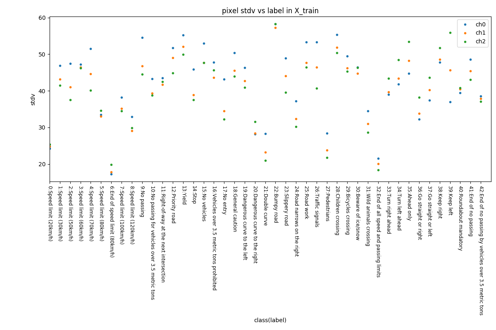

As explained above, the training dataset may have some issue to train like:  
 1. sample number shortage in some lables  
 2. low contrast(dark) images  
 3. low variance in some labels  

##2.2. an exploratory visualization of the dataset.

Here is a quick look of typical images in the training dataset.

This Dataset has a lot of similar images that seem to be augmented via image processing techniques like changing brightness, contrast, chroma and cropping position.

##2.3. averaged class images of the dataset.

Here are class example images(the first class image in the training dataset) and class average images.

All class average images still have their own characteristic enough to recognize as traffic signs.

But some classes seem to have some troubles.

 1. low chroma: class 6, 32, 41, 42
 2. un-necessary background texture: class 16, 19, 20, 24, 30
 3. dark brightness: class 3, 5, 6, 7, 10, 20

<!-- 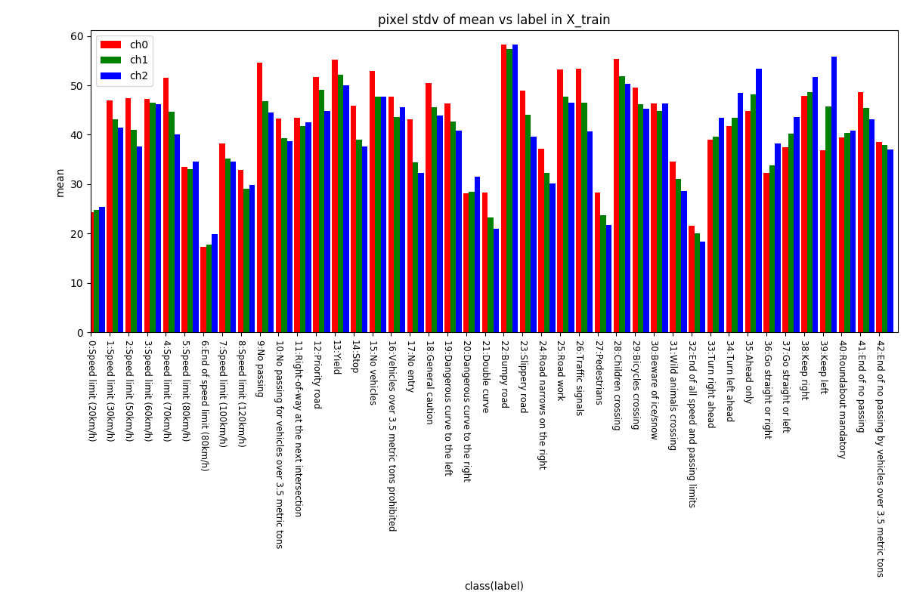 -->

#3. Feasibility Test

The training dataset potentially has trouble factors as described above.  
So I had feasibility tests before selecting methods for pre-processing, CNN design and augmenting image data in order to reduce the training data risk.

At the first, I made a reasonable scale model for the feasibility tests.  
This model is bigger than the LeNet-5 on lesson 8 and would be smaller than the final model, so I named it "middle model".

###3.1 design of "middle model" and training parameters

Here are the specifications of the middle model and training parameters.

| Layer         		|     Description	        					| 
|:----------------------|:----------------------------------------------| 
| Input         		| 32x32x3 RGB/Gray image   						| 
| Convolution 5x5     	| 1x1 stride, VALID padding, outputs 28x28x16 	|
| Batch Normalization	|												|
| RELU					|												|
| Max pooling	      	| 2x2 stride, VALID padding, outputs 14x14x16	|
| Convolution 5x5     	| 1x1 stride, VALID padding, outputs 10x10x48 	|
| RELU					|												|
| Max pooling	      	| 2x2 stride, VALID padding, outputs 5x5x48		|
| flatten				| 5x5x48 => 1200 								|
| Fully connected		| outputs 100  									|
| RELU					|												|
| Dropout				| keep prob. 0.5								|
| Fully connected		| outputs 100  									|
| RELU					|												|
| Dropout				| keep prob. 0.5								|
| Softmax				| outputs 43 (class number)						|

| Title         		|     Description	        					| 
|:----------------------|:----------------------------------------------| 
| Optimizer				| Adam
| learning_rate			| 0.0002
| batch size			| 100
| EPOCH Number			| 200

###3.2 original training image data overview

Following figure shows a pixel mean value and stdev distribution for each training images.

To make training work better, following normalization types are possible.

- Type0: normalize with mean and stdev of all pixels in the training data
- Type1: normalize with mean and stdev of each images pixels
- Type2: normalize with mean and stdev of RGB each image plane pixels

Following figures show distributions of pixel mean value and stdev for each types.

After the normalization, the average images of each class are up as follow.

Relatively to the average images without normalization, described above, the dark brightness issue is declined by type 1 and 2 normalizations.
But the low chroma and background texture issues still remain in the normlaized images.  
These issues can be resolved by augmenting training data.

###3.3 potential of "middle model" for the normalization type and color information use

To check the potential of the middle mode, I examined 7 types of input data as follow.

| No | Title      | image type | Normalization type									| 
|:---|:-----------|:-----------|:---------------------------------------------------| 
| 0  | RGB        | RGB-3ch    | Not normalized										|
| 1  | RGB-Type0  | RGB-3ch    | normalized for all pixels in the training data		|
| 2  | RGB-Type1  | RGB-3ch    | normalized for each images pixels					|
| 3  | RGB-Type2  | RGB-3ch    | normalized for RGB each image plane pixels			|
| 4  | Gray       | Gray       | Not normalized										|
| 5  | Gray-Type0 | Gray       | normalized for all pixels in the training data		|
| 6  | Gray-Type1 | Gray       | normalized for each images pixels					|

Normalization is executed by a follwing equation.

    normalized_image = (org_image - mean) / (2.0 * stdev)

After 200 epochs of training, every type obtained 93% over in validation accuracy as below.

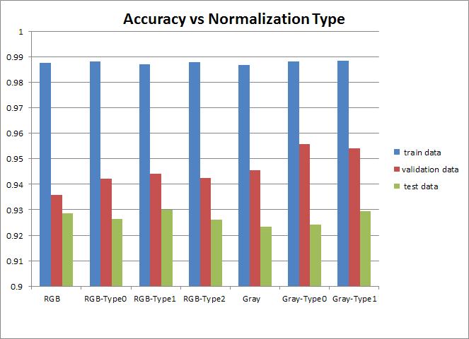

All of the input type seem to get more accuracy after more training.

###3.4 selection of pre-processing method for the input data format

I decided to **take RGB-type1** as the input format to study hereafter, however the feasibility test shows that **gray scale gets better accuracy than RGB input**.

All the 7 input format types, include RGB format, already satisfy the 93% accuracy goal of the project.  
So I can challenge something like that can solove the low-chroma and the background texture issues above.

The RGB input may be useful to make sure what modification affects to the issues of the training dataset.

###3.5 a result of "middle model" with RGB-type1 input

As "middle model" feasibility test, I got examples that this model could not work well on, as belows.  
Some classes appear to have some problems, other than the known troublesome class, 

<!-- (array([ 1,  4,  3,  3,  0,  2,  4,  2,  1,  2, -->
<!-- 	      0,  0,  0,  2,  0,  0, 22,  0,  1,  1, -->
<!-- 		  7, 15,  3,  3,  5,  5,  0,  4,  0,  2, -->
<!-- 		  0,  1,  0,  0,  3,  0,  0,  0,  0,  0, -->
<!-- 		 10,  3,  0]),  -->

Compare to numbers of training data, the failed classes don't seem to have enough training data.

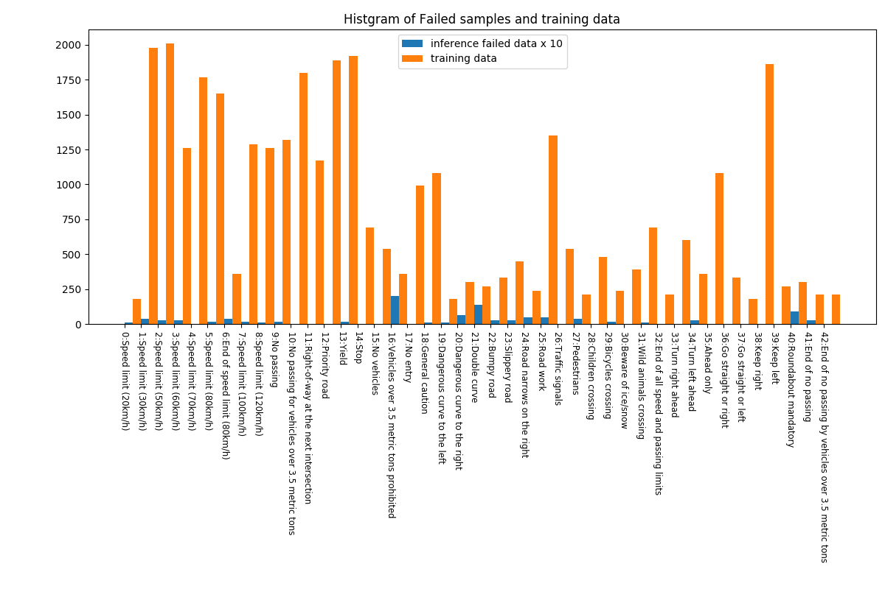

###3.6 quick looks of failed images at "middle model" with RGB-type1 input

####3.6.1 class 16

This class validation data has very low-chroma images, but the training dataset for the class dosesn't have such images.

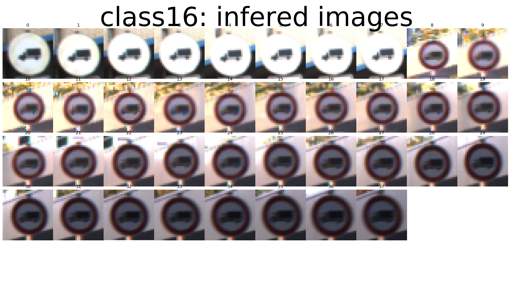 

####3.6.2 class 21

This class validation data has low resolution images, but the training dataset for the class doesn't have such images.

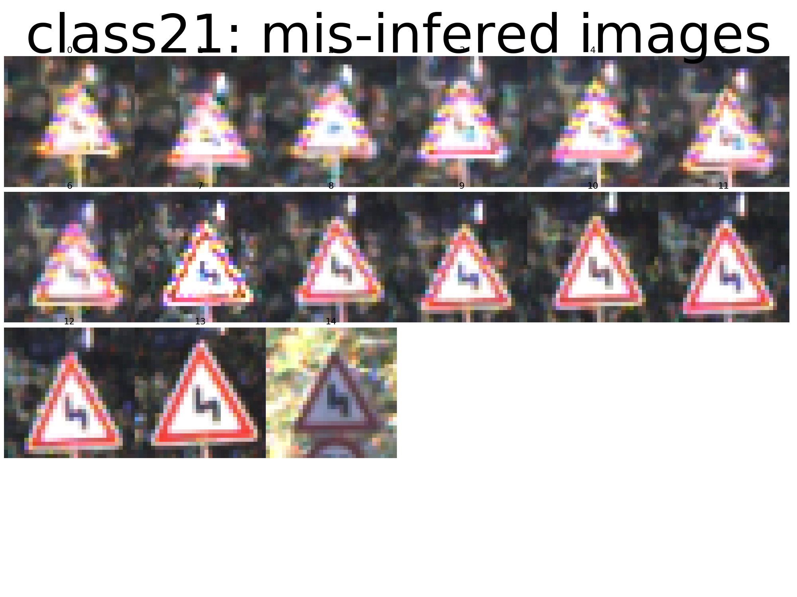
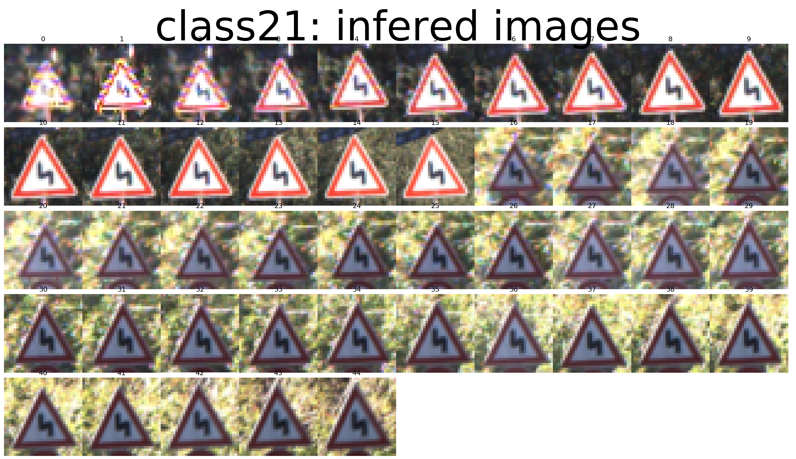 

####3.6.3 class 40

This class validation data has very dark and low contrast images, but the training dataset for the class doesn't have such images.

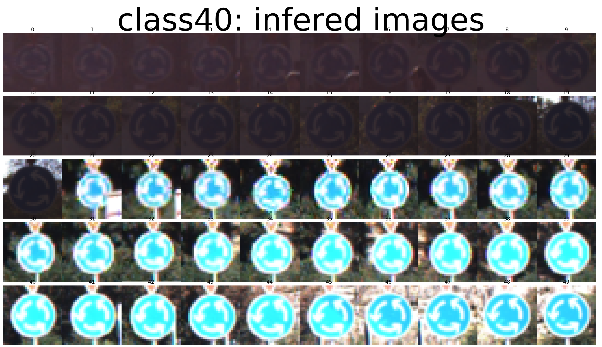 
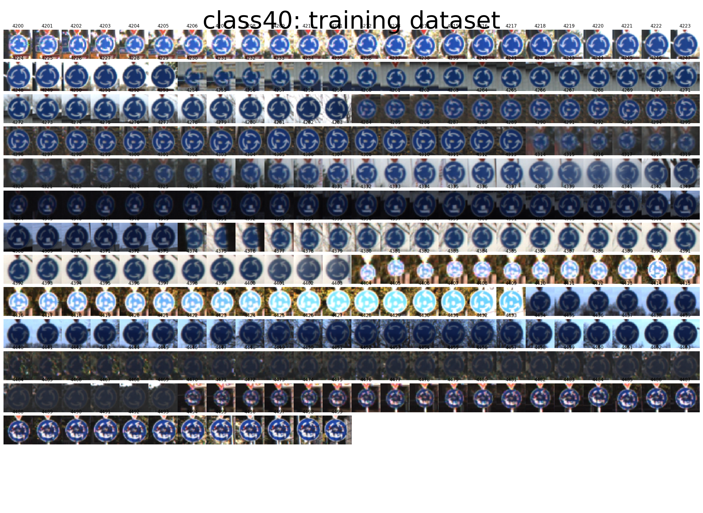

####3.6.4 class 20

This class validation data has small traffic sign images, but the training dataset for the class doesn't have such images.

 
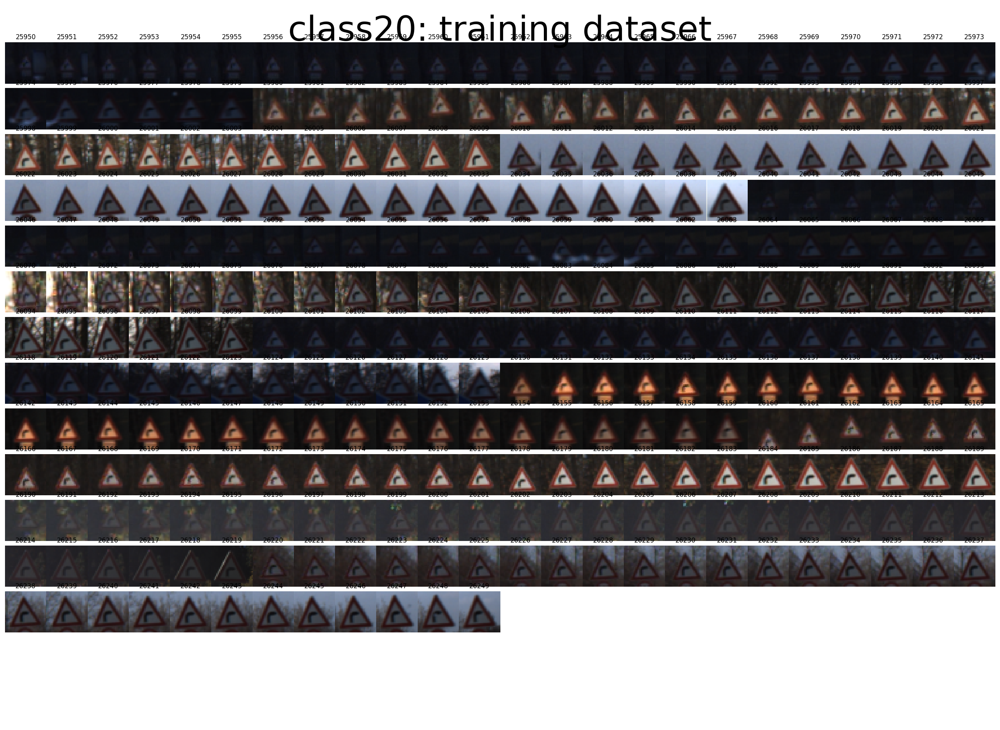

####3.6.5 class 24

This class validation data has very dark and low contrast images, but the training dataset for the class doesn't have such images.

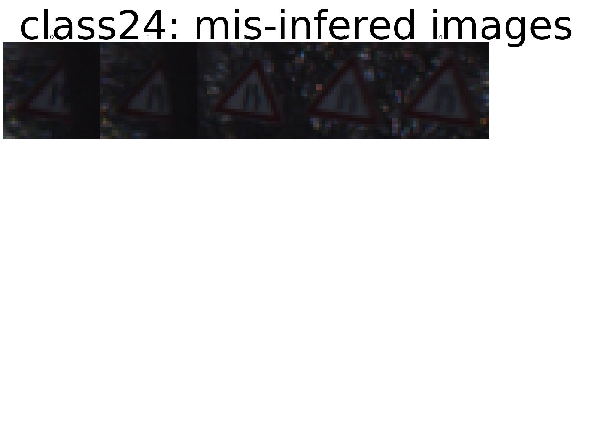
 

####3.6.6 class 27

This class validation data has high contrast background images, but the training dataset for the class doesn't have such images.

 
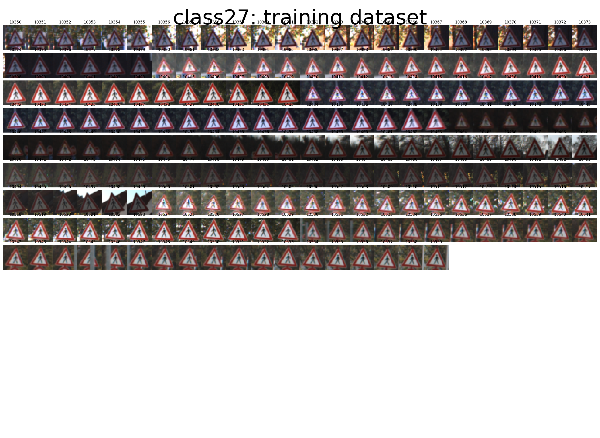

#4. Design and Test a Model Architecture

##4.1 "large model" Architecture

The quick looks above seems to show that "middle model" isn' enough to express textures inside traffic signs other than the training dataset issue.  
So I decided to enlargep the filter tap size of the first convolutional network and two fully networks.

Therfore, I call the final model architecture "large model".

| Layer         		|     Description	        					| 
|:----------------------|:----------------------------------------------| 
| Input         		| 32x32x3 RGB image								| 
| Convolution 7x7     	| 1x1 stride, VALID padding, outputs 26x26x64 	|
| Batch Normalization	|												|
| RELU					|												|
| Max pooling	      	| 2x2 stride, VALID padding, outputs 13x13x64	|
| Convolution 5x5     	| 1x1 stride, VALID padding, outputs 9x9x84 	|
| RELU					|												|
| Max pooling	      	| 2x2 stride, SAME padding, outputs 5x5x84		|
| flatten				| 5x5x84 => 2100 								|
| Fully connected		| outputs 240  									|
| RELU					|												|
| Dropout				| keep prob. 0.5								|
| Fully connected		| outputs 240  									|
| RELU					|												|
| Dropout				| keep prob. 0.5								|
| Softmax				| outputs 43 (class number)						|

##4.2 training parameters

| Title         		|     Description	        					| 
|:----------------------|:----------------------------------------------| 
| Optimizer				| Adam
| learning_rate			| 0.0002
| batch size			| 100
| EPOCH Number			| 200

ここから書く

###2. Describe what your final model architecture 
 
looks like including model type, layers, layer sizes, connectivity,
etc.) Consider including a diagram and/or table describing the final
model.

My final model consisted of the following layers:

| Layer         		|     Description	        					| 
|:---------------------:|:---------------------------------------------:| 
| Input         		| 32x32x3 RGB image   							| 
| Convolution 3x3     	| 1x1 stride, same padding, outputs 32x32x64 	|
| RELU					|												|
| Max pooling	      	| 2x2 stride,  outputs 16x16x64 				|
| Convolution 3x3	    | etc.      									|
| Fully connected		| etc.        									|
| Softmax				| etc.        									|
|						|		      									|

###3. Describe how you trained your model. The discussion can include the type of optimizer, the batch size, number of epochs and any hyperparameters such as learning rate.

To train the model, I used an ....

###4. Describe the approach taken for finding a solution and getting the validation set accuracy to be at least 0.93. Include in the discussion the results on the training, validation and test sets and where in the code these were calculated. Your approach may have been an iterative process, in which case, outline the steps you took to get to the final solution and why you chose those steps. Perhaps your solution involved an already well known implementation or architecture. In this case, discuss why you think the architecture is suitable for the current problem.

My final model results were:
* training set accuracy of ?
* validation set accuracy of ? 
* test set accuracy of ?

If an iterative approach was chosen:
* What was the first architecture that was tried and why was it chosen?
* What were some problems with the initial architecture?
* How was the architecture adjusted and why was it adjusted? Typical adjustments could include choosing a different model architecture, adding or taking away layers (pooling, dropout, convolution, etc), using an activation function or changing the activation function. One common justification for adjusting an architecture would be due to overfitting or underfitting. A high accuracy on the training set but low accuracy on the validation set indicates over fitting; a low accuracy on both sets indicates under fitting.
* Which parameters were tuned? How were they adjusted and why?
* What are some of the important design choices and why were they chosen? For example, why might a convolution layer work well with this problem? How might a dropout layer help with creating a successful model?

If a well known architecture was chosen:
* What architecture was chosen?
* Why did you believe it would be relevant to the traffic sign application?
* How does the final model's accuracy on the training, validation and test set provide evidence that the model is working well?

largeモデルの認識結果

- Model Architecture
    - アーキの特徴量とその品質
        - モデルのタイプ
        - 階層数
        - 各層の大きさ
    - 図示することを推奨する

- Model Architectureの設計とテスト
    - Model Training
        - 学習方法: Optimizer batch size, epoch数, hyperparametersの値
    - Solution Approach
        - アプローチの内容
        - Accuracy on the validation set is 0.93 or greater.

##4.2 pre-processing via RGB-type1

Describe how you preprocessed the image data.
 What techniques were chosen and why did you choose these techniques? 
Consider including images showing the output of each preprocessing technique. 
Pre-processing refers to techniques such as converting to grayscale, normalization, etc. 

##4.3 Training result

##4.4 Training result

##4.5. Test a Model on New Images

新たな画像５枚を選んで認識させる

- Test a Model on New Images
    - Acquiring New Images: German Traffic signsから5つの画像を加え、図示し、分類が難しいかどうか論じる
    - Performance on New Images: キャプチャ画像をテストすつ時のモデルの性能
    - Performance on New Images: テストセットに対する、新しい画像に対する性能
    - Model Certainty - Softmax Probabilities:

###1. Choose five German traffic signs found on the web and provide them in the report. For each image, discuss what quality or qualities might be difficult to classify.

Here are five German traffic signs that I found on the web:

![alt text][image4] ![alt text][image5] ![alt text][image6] 
![alt text][image7] ![alt text][image8]

The first image might be difficult to classify because ...

###2. Discuss the model's predictions on these new traffic signs and compare the results to predicting on the test set. At a minimum, discuss what the predictions were, the accuracy on these new predictions, and compare the accuracy to the accuracy on the test set (OPTIONAL: Discuss the results in more detail as described in the "Stand Out Suggestions" part of the rubric).

Here are the results of the prediction:

| Image			        |     Prediction	        					| 
|:---------------------:|:---------------------------------------------:| 
| Stop Sign      		| Stop sign   									| 
| U-turn     			| U-turn 										|
| Yield					| Yield											|
| 100 km/h	      		| Bumpy Road					 				|
| Slippery Road			| Slippery Road      							|

The model was able to correctly guess 4 of the 5 traffic signs, which gives an accuracy of 80%. This compares favorably to the accuracy on the test set of ...

###3. Describe how certain the model is when predicting on each of the five new images by looking at the softmax probabilities for each prediction. Provide the top 5 softmax probabilities for each image along with the sign type of each probability. (OPTIONAL: as described in the "Stand Out Suggestions" part of the rubric, visualizations can also be provided such as bar charts)

The code for making predictions on my final model is located in the 11th cell of the Ipython notebook.

For the first image, the model is relatively sure that this is a stop sign (probability of 0.6), and the image does contain a stop sign. The top five soft max probabilities were

| Probability         	|     Prediction	        					| 
|:---------------------:|:---------------------------------------------:| 
| .60         			| Stop sign   									| 
| .20     				| U-turn 										|
| .05					| Yield											|
| .04	      			| Bumpy Road					 				|
| .01				    | Slippery Road      							|

For the second image ... 

オプション

#5. Augmenting trainig images.

The difference between the original data set and the augmented data set is the following ... 

OPTIONAL: 
As described in the "Stand Out Suggestions" part of the rubric, 
if you generated additional data for training, 
describe why you decided to generate additional data, 
how you generated the data, 
and provide example images of the additional data. 
Then describe the characteristics of the augmented training set like number of images in the set,
number of images for each class, etc.

##5.1 plans to augment the training data

As I got 4 points of view about the trainig data issue as follows.

 1. low chroma: class 6, 32, 41, 42
 2. un-necessary background texture: class 16, 19, 20, 24, 30
 3. dark brightness: class 3, 5, 6, 7, 10, 20 (Normalization may solve)
 4. trainig data shortage: class 20, 21, 40 ...

I take augmenting plans to resolve them as below.

| method                 | porpose                           | target labels(class) |
|:-----------------------|:----------------------------------|:---------------------|
| enhance color			 | low-chroma expansion				 | 6, 32, 41, 42		|
| add vivid images		 | low-chroma expansion				 | 6, 32, 41, 42		|
| random value charge	 | back ground texture elimination	 | 16, 19, 20, 24, 30	|
| random position shift	 | back ground texture elimination	 | 16, 19, 20, 24, 30	|
| enhance brightness	 | dark brightness					 | 3, 5, 6, 7, 10, 20	|
| add bright images		 | dark brightness					 | 3, 5, 6, 7, 10, 20	|
| add various images	 | trainig data shortage			 | 20, 21, 40 ...		|
| ノイズを加える

##5.2 augmenting training dataset

## (Optional) Visualizing the Neural Network (See Step 4 of the Ipython notebook for more details)
###1. Discuss the visual output of your trained network's feature maps. What characteristics did the neural network use to make classifications?

#6. Visualize the network's feature maps

Step 4 (Optional): Visualize the Neural Network's State with Test Images
This Section is not required to complete but acts as an additional excersise for understaning the output of a neural network's weights. While neural networks can be a great learning device they are often referred to as a black box. We can understand what the weights of a neural network look like better by plotting their feature maps. After successfully training your neural network you can see what it's feature maps look like by plotting the output of the network's weight layers in response to a test stimuli image. From these plotted feature maps, it's possible to see what characteristics of an image the network finds interesting. For a sign, maybe the inner network feature maps react with high activation to the sign's boundary outline or to the contrast in the sign's painted symbol.

Provided for you below is the function code that allows you to get the visualization output of any tensorflow weight layer you want. The inputs to the function should be a stimuli image, one used during training or a new one you provided, and then the tensorflow variable name that represents the layer's state during the training process, for instance if you wanted to see what the LeNet lab's feature maps looked like for it's second convolutional layer you could enter conv2 as the tf_activation variable.

For an example of what feature map outputs look like, check out NVIDIA's results in their paper End-to-End Deep Learning for Self-Driving Cars in the section Visualization of internal CNN State. NVIDIA was able to show that their network's inner weights had high activations to road boundary lines by comparing feature maps from an image with a clear path to one without. Try experimenting with a similar test to show that your trained network's weights are looking for interesting features, whether it's looking at differences in feature maps from images with or without a sign, or even what feature maps look like in a trained network vs a completely untrained one on the same sign image.

### Visualize your network's feature maps here.
### Feel free to use as many code cells as needed.

# image_input: the test image being fed into the network to produce the feature maps
# tf_activation: should be a tf variable name used during your training procedure that represents the calculated state of a specific weight layer
# activation_min/max: can be used to view the activation contrast in more detail, by default matplot sets min and max to the actual min and max values of the output
# plt_num: used to plot out multiple different weight feature map sets on the same block, just extend the plt number for each new feature map entry

def outputFeatureMap(image_input, tf_activation, activation_min=-1, activation_max=-1 ,plt_num=1):
    # Here make sure to preprocess your image_input in a way your network expects
    # with size, normalization, ect if needed
    # image_input =
    # Note: x should be the same name as your network's tensorflow data placeholder variable
    # If you get an error tf_activation is not defined it may be having trouble accessing the variable from inside a function
    activation = tf_activation.eval(session=sess,feed_dict={x : image_input})
    featuremaps = activation.shape[3]
    plt.figure(plt_num, figsize=(15,15))
    for featuremap in range(featuremaps):
        plt.subplot(6,8, featuremap+1) # sets the number of feature maps to show on each row and column
        plt.title('FeatureMap ' + str(featuremap)) # displays the feature map number
        if activation_min != -1 & activation_max != -1:
            plt.imshow(activation[0,:,:, featuremap], interpolation="nearest", vmin =activation_min, vmax=activation_max, cmap="gray")
        elif activation_max != -1:
            plt.imshow(activation[0,:,:, featuremap], interpolation="nearest", vmax=activation_max, cmap="gray")
        elif activation_min !=-1:
            plt.imshow(activation[0,:,:, featuremap], interpolation="nearest", vmin=activation_min, cmap="gray")
        else:
            plt.imshow(activation[0,:,:, featuremap], interpolation="nearest", cmap="gray")

# TODO
* [X] Load the data set (see below for links to the project data set)
* [ ] Explore, summarize and visualize the data set
* [ ] Design, train and test a model architecture
* [ ] Preprocessing: preprocessing techniques used
* [ ] Preprocessing: and why these techniques were chosen.
* [ ] Model Architecture: the type of model used, the number of layers, the size of each layer. 
* [ ] Model Architecture: Visualizations emphasizing particular qualities of the architecture
* [ ] Model Training: how the model was trained by discussing, what optimizer was used/batch size/number of epochs/values for hyperparameters.
* [ ] Solution Approach: the approach to finding a solution. 
* [ ] Solution Approach: Accuracy on the validation set is 0.93 or greater.
* [ ] Acquiring New Images: five new German Traffic signs found on the web, and the images are visualized. 
* [ ] Acquiring New Images: Discussion is made as to particular qualities of the images or traffic signs in the images that are of interest, 
* [ ] Acquiring New Images: such as whether they would be difficult for the model to classify.
* [ ] Performance on New Images: the performance of the model when tested on the captured images. 
* [ ] Performance on New Images: The performance on the new images is compared to the accuracy results of the test set.
* [ ] Model Certainty - Softmax Probabilities: The top five softmax probabilities of the predictions on the captured images are outputted.
* [ ] Model Certainty - Softmax Probabilities: discusses how certain or uncertain the model is of its predictions.
* [ ] Notebookを提出する際に、HTML版のファイル名を report.html にすること

---

- Datasetの探索、サマリ、図示
- Model Architectureの設計とテスト
    - 前処理の説明と、その理由
    - Model Architecture
        - アーキの特徴量とその品質
            - モデルのタイプ
            - 階層数
            - 各層の大きさ
        - 図示することを推奨する
    - Model Training
        - 学習方法: Optimizer batch size, epoch数, hyperparametersの値
    - Solution Approach
        - アプローチの内容
        - Accuracy on the validation set is 0.93 or greater.
- Test a Model on New Images
    - Acquiring New Images: German Traffic signsから5つの画像を加え、図示し、分類が難しいかどうか論じる
    - Performance on New Images: キャプチャ画像をテストすつ時のモデルの性能
    - Performance on New Images: テストセットに対する、新しい画像に対する性能
    - Model Certainty - Softmax Probabilities:

---

更に

- トレーニング画像セットの強化
    - 回転、移動、拡大、反転、色混同
- precision and recallなどで、解析してから、改善する

画像の水増し方法をTensorFlowのコードから学ぶ
http://qiita.com/Hironsan/items/e20d0c01c95cb2e08b94

  - random_crop
  - random_flip_left_right
  - random_brightness
  - random_contrast
  - per_image_whitening

  
  - Image processing for training the network. Note the many random
  - distortions applied to the image.
  
  - Randomly crop a [height, width] section of the image.
  distorted_image = tf.random_crop(reshaped_image, [height, width, 3])
  
  - Randomly flip the image horizontally.
  distorted_image = tf.image.random_flip_left_right(distorted_image)
  
  - Because these operations are not commutative, consider randomizing
  - the order their operation.
  distorted_image = tf.image.random_brightness(distorted_image, max_delta=63)
  distorted_image = tf.image.random_contrast(distorted_image, lower=0.2, upper=1.8)
  
  - Subtract off the mean and divide by the variance of the pixels.
  float_image = tf.image.per_image_whitening(distorted_image)
